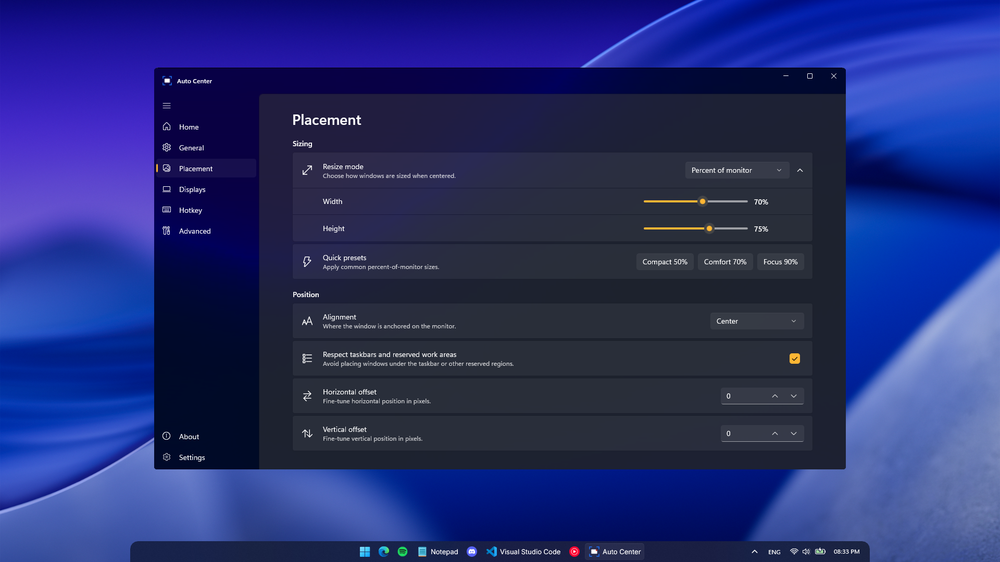
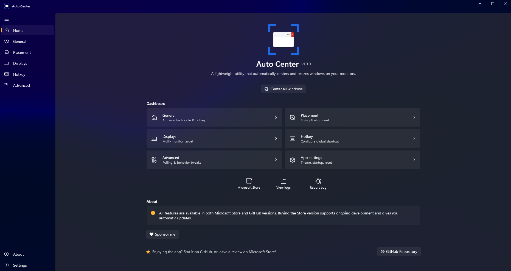
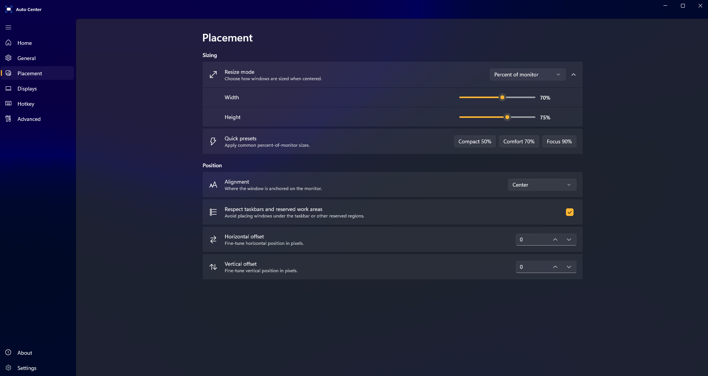
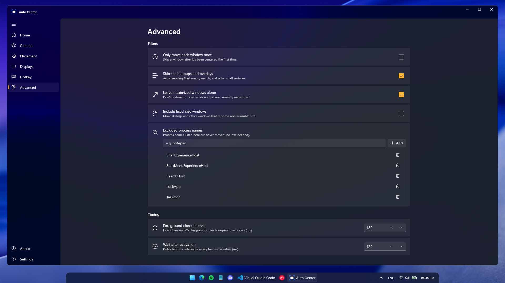

<h1 align="center">Auto Center</h1>

<p align="center">
  <a href="https://github.com/jihedkdiss/AutoCenter/releases/latest"></a>
  <a href="https://apps.microsoft.com/detail/9NJBD74TXX5B"></a>
  <a href="LICENSE"></a>
  <a href="https://github.com/jihedkdiss/AutoCenter/stargazers"></a>
  <a href="https://jihedkdiss.github.io/AutoCenter/"></a>
</p>

---

Auto Center is a lightweight Windows utility that automatically centers and resizes windows on your monitors. Built with **WinUI 3** and **.NET 8**, the UI blends in with Windows 11 and stays out of your way until you need it.

<a href="https://apps.microsoft.com/detail/9NJBD74TXX5B?referrer=appbadge&cid=GitHub_README&mode=direct">
  
</a>

<p align="center">
  
</p>

## Features ✨
- **Auto-center new windows** — newly focused windows are automatically centered
- **Global hotkey** — press a hotkey to center the active window on demand
- **Shift sequence hotkey** — double-tap Shift (or Ctrl/Alt) to trigger centering
- **Multiple sizing modes** — preserve size, percent of monitor, fixed pixels, uniform margin, or separate margins
- **9 alignment positions** — center, top-left, bottom-right, and everything in between
- **Multi-monitor support** — target the window's current monitor, the primary monitor, or a specific display
- **Smart filtering** — skip shell overlays, maximized windows, and fixed-size windows
- **System tray** — minimizes to tray instead of closing
- **Launch at startup** — optional automatic startup
- **Native Windows-like design** — WinUI 3 with light/dark theme support

## Screenshots 🖼️

<table>
  <tr>
    <td width="50%" align="center">
      
      <sub><b>Home</b> — every section one click away, with a Center-all action front and center.</sub>
    </td>
    <td width="50%" align="center">
      
      <sub><b>Placement</b> — resize mode, alignment, and per-axis offsets, all native WinUI 3.</sub>
    </td>
  </tr>
  <tr>
    <td width="50%" align="center">
      
      <sub><b>Advanced</b> — fine-grained filters and per-process exclusions with one-click add &amp; remove.</sub>
    </td>
    <td width="50%" align="center">
      
      <sub><b>On Windows 11</b> — Mica blur, system accent, light and dark mode out of the box.</sub>
    </td>
  </tr>
</table>

More at <https://jihedkdiss.github.io/AutoCenter/#screenshots>.

## How to install 📥
### Which version should you choose?
The **Microsoft Store version** provides automatic updates and one-click installation as a one-time purchase that supports development.
The **GitHub version** is completely free, fully featured, and open-source — but requires manual updates.
Read more in the [Sustainability & The Microsoft Store](#sustainability--the-microsoft-store-) section below.

### Using Microsoft Store
<a href="https://apps.microsoft.com/detail/9NJBD74TXX5B?referrer=appbadge&cid=GitHub_README_2&mode=direct">
  
</a>

> Looking for Auto Center settings? You can access them by clicking the system-tray icon.

### Using .msixbundle installer
1. Go to the [latest release](https://github.com/jihedkdiss/AutoCenter/releases/latest) page
2. Download the **`*.cer`** file *(real certificates cost money)*
3. Open the certificate and press **"Install Certificate..."**
4. On the Certificate Import Wizard, select **"Local Machine"**, press **"Next"** and grant Admin Access
5. Select **"Place all certificates in the following store"**, then **"Browse..."**, choose **"Trusted Root Certification Authorities"** and **"OK"**
6. Press **"Next"** and then **"Finish"**. Confirm if prompted
7. Download the **`*.msixbundle`** file
8. The App Installer will pop up — press **"Install"** (or **"Update"** if you've installed Auto Center before)

Alternatively, download the `Installer` artifact from the [latest release](https://github.com/jihedkdiss/AutoCenter/releases/latest) and run `AutoCenter_Installer.bat`, which automates steps 2–8 above.

## Requirements
- Windows 10 version 1809 (build 17763) or later
- Bundled `Microsoft.WindowsAppSDK` runtime (no separate install needed when using the Store / MSIX installers)
- For unpackaged dev builds: [.NET 8 Desktop Runtime](https://dotnet.microsoft.com/download/dotnet/8.0)

## Build
```
dotnet build AutoCenter/AutoCenter.csproj /p:Platform=x64
```

For local development without packaging, build and launch the produced executable from `AutoCenter/bin/x64/Debug/net8.0-windows10.0.19041.0/win-x64/`. Note that "Launch at startup" and other Store-only behaviors only work when the app is installed from a packaged build.

To start minimized: pass `--minimized`.

## Microsoft Store packaging
The project is a single-project MSIX app (`Package.appxmanifest`) submitted via Partner Center. Two MSBuild configurations are defined:

| Configuration | Purpose | Output |
|---|---|---|
| `Release` | Microsoft Store upload | `.msixupload` (under `AutoCenter\AppPackages\`) |
| `GitHub Release` | FOSS GitHub release | `_Test` folder with `.msixbundle`, `.cer`, and `Add-AppDevPackage.ps1` |

Build a Store upload bundle (x64 + ARM64) locally:
```
msbuild AutoCenter\AutoCenter.csproj `
  /t:Restore /p:Configuration=Release /p:Platform=x64

msbuild AutoCenter\AutoCenter.csproj `
  /p:Configuration=Release /p:Platform=x64 `
  /p:AppxBundle=Always /p:AppxBundlePlatforms="x64|arm64" `
  /p:UapAppxPackageBuildMode=StoreUpload `
  /p:AppxPackageSigningEnabled=false `
  /p:GenerateAppxPackageOnBuild=true
```

CI (`.github/workflows/build-msix.yml`) produces both artifacts on every change to `Package.appxmanifest`.

Identity values used in `Package.appxmanifest` come from Partner Center → App management → Product identity. To regenerate the tile/Store PNG asset set from the source art:
```
python tools/generate_icon.py
```

Before submission, bump `<Identity Version="x.y.z.0">` in `Package.appxmanifest` (the trailing `.0` is reserved for Store).

## Settings
Settings are stored in `%LOCALAPPDATA%\AutoCenter\settings.json` and can be reset from the Settings page.

### Default settings
| Setting | Default |
|---|---|
| Auto center new windows | On |
| Enable global hotkey | On |
| Hotkey bypass fixed-size filter | On |
| Use Shift press sequence | On (2 presses, 500 ms timeout) |
| Standard hotkey | Ctrl+Alt+C |
| Only move each window once | Off |
| Skip shell popups and overlays | On |
| Leave maximized windows alone | On |
| Include fixed-size windows | Off |
| Resize mode | Uniform margin (20 px) |
| Alignment | Center |
| Target monitor | Current window monitor |
| Respect taskbars and work areas | On |
| Launch at startup | On |
| Theme | System |

## Contributing 💖
Please feel free to contribute in any way you can! Check out [CONTRIBUTING.md](.github/CONTRIBUTING.md) to get started.

### Thanks to our contributors!
<a href="https://github.com/jihedkdiss/AutoCenter/graphs/contributors">
  
</a>

## Sustainability & The Microsoft Store 💰
Auto Center is and always will be free and open-source. You can download the latest builds from the [Releases](https://github.com/jihedkdiss/AutoCenter/releases/latest) tab or compile the project yourself to access the full feature set without restrictions.

Maintaining a project of this scale takes time and effort. To support ongoing development, the Microsoft Store version offers a convenient way to install the app as a small one-time purchase.

- **Microsoft Store version:** automatic background updates and one-click installation. A small one-time purchase helps fund development.
- **GitHub version:** completely free, fully featured, and open-source. The only trade-off is that updates and installation must be done manually.

Thank you for your support and understanding!

## Privacy
Auto Center makes **no network calls** and collects **no telemetry**. Settings and crash logs stay on your machine in `%LOCALAPPDATA%\AutoCenter\`. Full privacy policy: <https://jihedkdiss.github.io/AutoCenter/privacy>.

## Credits 🙌
- [Jihed Kdiss](https://github.com/jihedkdiss) — Original Developer, Microsoft Store Publisher
- Inspired by [FluentFlyout](https://github.com/unchihugo/FluentFlyout) — for the dual Store / FOSS distribution model

### Dependencies
- [Microsoft.WindowsAppSDK](https://github.com/microsoft/WindowsAppSDK)
- [CommunityToolkit.WinUI.Controls.SettingsControls](https://github.com/CommunityToolkit/Windows)

## License
[MIT](LICENSE)
